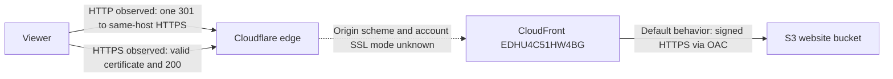

# Website delivery operations

## Public route contract

The checked CloudFront viewer-request function is `terraform/functions/rewrite-extensionless.js`. Terraform loads that exact source file and the Node VM route tests execute it directly.

- `/` rewrites to `/index.html`.
- Extensionless paths such as `/stats`, `/graph`, and unknown page names rewrite to the matching `.html` object.
- A non-root path ending in `/` returns a permanent redirect to the extensionless form. Query fields retain the encoded CloudFront event representation. When `multiValue` is present it already contains the first occurrence, so the redirect serializes that array once and does not also append `value`.
- Paths with filename extensions remain unchanged, including résumé downloads and Next.js static assets.
- Redirect paths always begin with one site-local slash. Additional leading slashes and backslashes are encoded before entering `Location` so unusual viewer input cannot create a protocol-relative external redirect.

The local tests include event fields containing `%20`, `%2B`, `%26`, `%25`, and repeated values. Their VM round trip follows AWS's published event-shape and normalization example, but it does not prove how every viewer request becomes a live CloudFront event. Before rollout, use an actual CloudFront test invocation and then send real public trailing-slash requests containing those encoded values and repeats. Inspect `Location`, follow it, and confirm the values retain their intended meaning. This runtime/viewer-to-event evidence has not yet been collected.

## Missing-page recovery

The static export contains a dark/orange `404.html` with a clear `Page not found` heading, links to the résumé and contact section, a specific document title, and `noindex, nofollow` robots metadata. Local preview checks require an actual HTTP 404 and 320-pixel fit.

CloudFront maps origin 403 and 404 responses to the checked document:

| Origin response | Response document | Viewer status | Error cache TTL |
| --- | --- | --- | --- |
| 403 | `/404.html` | 404 | 10 seconds |
| 404 | `/404.html` | 404 | 10 seconds |

This translation applies to any origin 403 or 404 response, including permission failures. Successful pages, static extension paths, resource identities, origin selection, and the existing cache behavior remain unchanged. The known-asset post-release check guards against hiding a broader origin-permission failure behind the recovery page.

## Access-log self-targeting

The log bucket remains the destination for website access logs under `website-log/` and CloudFront logs under `cloudfront-logs/`. Its bucket, stored objects, versioning, bucket policy, ownership controls, three lifecycle rules, and all Terraform resource identities remain in place. The only relationship removed by E2 is the log bucket writing S3 access logs about itself back into `this-bucket-log/`.

The controller verified the live self-target on 2026-09-08 using read-only `GetBucketLogging`: `mostly-upward-lion-log-bucket` targeted itself with prefix `this-bucket-log/`. No setting was changed. The existing metadata-only prefix baseline at 2026-09-08 07:17:28 UTC observed:

| Prefix | Current objects observed | Bytes observed | Listing boundary |
| --- | ---: | ---: | --- |
| `cloudfront-logs/` | 11,894 | 15,127,314 | Complete 12-page listing |
| `website-log/` | 71,198 | 58,489,829 | Complete 72-page listing |
| `this-bucket-log/` | At least 100,000 | At least 113,812,996 | Capped after 100 pages; incomplete |

The listing read object count and size metadata only; it did not fetch log bodies or retain keys. It excluded versions and delete markers and was not an atomic snapshot. The self-log row is a lower bound, not an exact total, growth rate, or savings estimate. Repeating the same 100-page cap can compare bounded observations but cannot yield an actual total-prefix growth delta. Quantified total growth requires complete comparable coverage or another explicitly justified metric and a documented observation window.

The configured lifecycle policy remains enabled for all three prefixes: current objects become eligible for expiration after 90 days, and versions become eligible after 30 days as noncurrent. This is configured policy rather than a physical deletion audit or an exact retention-duration guarantee; noncurrent age starts when a version becomes noncurrent. Expiration also does not prove that analytics history can be reconstructed from remaining objects.

The controller-owned consolidated state-backed plan must classify the E2 action as removal of only `aws_s3_bucket_logging.log_bucket_logs`. Replacement or deletion of the log bucket, stored data, versioning, normal website/CloudFront log delivery, or any lifecycle change fails this scope. No real plan or apply occurred during E2 implementation.

After an authorized release, use read-only checks to confirm the log bucket no longer targets itself while website and CloudFront sources still target the same bucket/prefixes. Existing queued S3 deliveries may arrive briefly. Record the observation interval and measurement coverage. If complete comparable coverage or another justified total metric is unavailable, retain only bounded observations and leave actual total growth and savings unmeasured.

## Transport path and verified boundary

The 2026-09-08 evidence supports this request path:

| Hop or setting | Verified nonsecret record | Evidence limit |
| --- | --- | --- |
| Viewer to Cloudflare | Apex and `www` HTTP each returned one Cloudflare 301 to same-host HTTPS and then 200. HTTPS homepage/deep-link checks returned 200 with ordinary certificate validation. | Observed paths do not expose account SSL mode, DNS proxy state, cache rules, or Browser Cache TTL. |
| Cloudflare to CloudFront | CloudFront distribution `EDHU4C51HW4BG` is reachable at `d2v6o77xftr5if.cloudfront.net`; direct HTTPS connections retaining apex or `www` Host/SNI returned 200 with certificate verification enabled. | The Cloudflare account is unauthenticated here. Its actual origin scheme is unknown, so this hop is not claimed encrypted. |
| CloudFront host coverage | Aliases are `andrewmalvani.com` and `www.andrewmalvani.com`. The attached ACM certificate is ISSUED, covers the apex and `*.andrewmalvani.com`, expires 2027-03-10T16:59:59-07:00, and uses SNI with minimum TLS policy `TLSv1.2_2021`. | Certificate and direct-origin success establish prerequisites for these hostnames; they do not prove Cloudflare is configured for Full (strict). Recheck validity at release. |
| CloudFront routing | The selected default origin is `mostly-upward-lion-website-bucket.s3.us-west-1.amazonaws.com` through OAC `E3Q6QZXOS9AMQ8`. The two custom apex/`www` origins exist but are not selected by the default behavior. | Preserve these origin/resource identities; do not mistake the unused custom origins for the live default hop. |
| CloudFront to S3 | OAC is S3 type, `signing_behavior=always`, `signing_protocol=sigv4`. AWS documents that always-sign S3 OAC uses HTTPS. | Configuration evidence, not a packet capture. See [AWS OAC prerequisites](https://docs.aws.amazon.com/AmazonCloudFront/latest/DeveloperGuide/private-content-restricting-access-to-s3.html). |
| Current CloudFront viewer policy | `allow-all`, retained in E3. | The old Terraform comment asserted Flexible mode without authenticated evidence. Public behavior cannot prove that setting, so a one-sided policy change is unsafe. |
| Public assets and cache behavior | Existing evidence records successful PDF, `stats.json`, and an actual HTML-referenced chunk. PDF/chunk showed public `max-age=14400` and Cloudflare MISS then HIT; stats showed `max-age=3600` and DYNAMIC. | A tiny public sample is not the account cache configuration, field performance evidence, or proof of the Cloudflare-to-CloudFront scheme. |

The source evidence is `evidence/delivery-entry-paths-before.json`, `evidence/delivery-origin-access-control.json`, `evidence/delivery-cache-before.json`, and the read-only distribution/certificate record in the SDD environment notes. No new public or cloud query was made for E3.

### Conditional coordinated rollout

Before any change, authenticated account access must record the nonsecret previous values for Cloudflare SSL/TLS mode, apex and `www` proxy state, Always Use HTTPS or equivalent redirect behavior, matching HTML/`stats.json` cache rules, and Browser Cache TTL. Record the current CloudFront viewer policy and checked distribution/configuration revision with them. The current Cloudflare values are unknown; do not fill them from public-response inference.

Choose the branch from that authenticated record:

1. **Full (strict) is active and origin validation succeeds.** Confirm both proxied hostnames use the expected CloudFront origin and repeat normal-certificate HTTPS origin checks for apex and `www`. Retain Full (strict). A separately reviewed coordinated plan may then change CloudFront's viewer policy to `redirect-to-https`; verify the complete entry-path matrix before accepting it.
2. **Flexible is active.** First revalidate the issued certificate's hostname coverage/expiry and direct HTTPS origin reachability. Save the complete previous settings. Change Cloudflare to Full (strict) first, then verify apex/`www` homepage, `/graph`, `/stats`, PDF, `stats.json`, and an actual current chunk over HTTPS with no loop or certificate error. Only after that succeeds may the reviewed CloudFront viewer-policy change proceed. Cloudflare's [Full (strict) requirements](https://developers.cloudflare.com/ssl/origin-configuration/ssl-modes/full-strict/) are the acceptance boundary.
3. **Origin validation fails.** Leave Cloudflare mode and CloudFront `allow-all` unchanged. Repair the exact certificate coverage, expiry, Host/SNI, DNS target, or HTTPS reachability failure, then repeat validation before returning to either branch above. Never disable certificate verification to pass the check.

If the authenticated mode is neither expected branch, either hostname is DNS-only, or the hostnames do not share the recorded configuration, stop and prepare an explicit coordinated plan for the actual state. Do not apply a generic redirect change.

Success requires HTTP entry paths to reach same-host HTTPS once, HTTPS pages/assets to succeed on apex and `www`, Cloudflare-to-CloudFront to use verified Full (strict), CloudFront-to-S3 to retain signed HTTPS, and no loop or certificate error. Post-release checks must cover homepage, graph, stats, PDF, `stats.json`, an actual candidate chunk, the unique 404 path, and the known-asset guard.

Rollback restores the complete recorded prior configuration in reverse order: restore CloudFront's prior viewer policy/configuration revision if it changed, restore the prior Cloudflare SSL/TLS mode, restore each hostname's prior proxy state, restore the prior edge redirect setting, and restore the prior matching cache rules and Browser Cache TTL. Then purge only through the reviewed procedure and repeat the same entry-path/origin checks. Restoring one redirect flag is not a complete rollback. Preserve diagnostic status/location/certificate evidence without recording credentials.

F19 remains open until authenticated Cloudflare mode/proxy evidence, the authorized coordinated change if needed, and the full post-release matrix are complete. E4's freshness claims also remain gated on the actual matching Cloudflare cache rules and Browser Cache TTL: Cloudflare can override origin directives, and a purge does not clear existing browser caches. See [Browser Cache TTL](https://developers.cloudflare.com/cache/how-to/edge-browser-cache-ttl/set-browser-ttl/) and [Cloudflare cache-control behavior](https://developers.cloudflare.com/cache/concepts/cache-control/).

## Release order and gates

Use one reviewed candidate `out` artifact and one consolidated state-backed Terraform plan. The plan must show the intended edge-function source and the two custom error responses for this task, alongside only other independently reviewed release changes. A real state-backed plan has not been run for this task; the controller owns that consolidated review with the prepared private inputs.

The workflow downloads the same candidate artifact produced by the plan job. Before Terraform apply it checks that `404.html` references candidate files that exist under `_next/static`. It uploads all candidate `_next/static` objects without deletion, then uploads `404.html` last. This order retains old hashed assets and makes the complete recovery page available before CloudFront can enable the error mapping. It does not upload or delete `stats.json`, and the later ordinary site sync still excludes that producer-owned object.

If the bucket does not exist, the pre-apply upload stops the release. Use the separately reviewed bootstrap procedure; do not create a temporary Terraform address or enable an error mapping whose recovery document is absent. The same stop applies if the candidate recovery document or any referenced candidate static asset is missing.

The analytics release gates remain load-bearing:

- A first creation or replacement of the analytics producer requires the public compatible reader check before apply.
- Ordinary analytics code updates remain downstream of website publication, CloudFront invalidation, and the public reader check.
- Follow the no-writer, durable-backup, and historical-preservation prerequisites in [analytics operations](./analytics.md) for an analytics cutover. Staging recovery assets does not satisfy or bypass them.

After apply, sync the complete same candidate export with the existing `stats.json` exclusion, then invalidate the distribution through the reviewed workflow. E4 and E5 may consolidate cache metadata and checked-artifact provenance later; they must retain this no-missing-document order and both analytics reader gates.

## Post-release verification

No production rollout or CloudFront invocation was performed during E1–E3 implementation. After an approved rollout:

1. Check `/`, `/stats`, `/stats/`, `/graph`, and `/graph/` on both public hostnames. Each page should work directly or through one purposeful redirect.
2. Repeat the trailing-slash checks with repeated fields and encoded space, plus, ampersand, and percent values. Inspect and follow `Location`; record the actual viewer-to-event/runtime behavior.
3. Request a unique nonexistent extensionless path. Require HTTP 404, the styled recovery page, working résumé/contact links, and no S3 XML access-denied response.
4. Request a known versioned Next.js asset and the résumé PDF. A successful asset response guards against hiding a broader origin-permission failure behind the custom 404.
5. Record response status, redirect location, cache/error-cache headers, checked commit and candidate artifact identity. Do not mark F15's live behavior closed until these public checks pass.

If the recovery document or its assets fail, stop further rollout, preserve the candidate and plan evidence, and restore a previously complete site artifact through the reviewed release path. Do not remove buckets, rename Terraform resources, or use the custom 404 to mask an origin-access problem.
